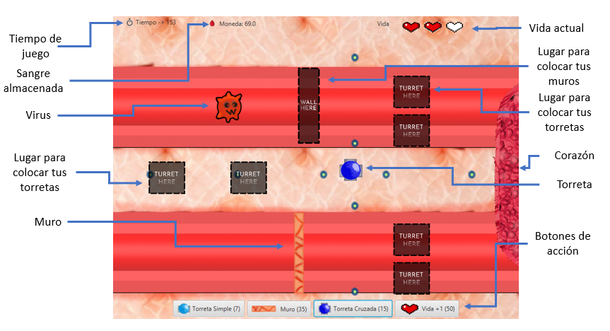
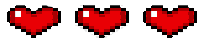

# ImmuneDefense

## ¿Qué es Immune Defense?

Immune Defense es un juego de estrategia estilo Tower Defense creado en JavaFX.

Tu objetivo como jugador es defender la base (Corazón) de los enemigos (Virus) obstaculizando sus caminos con la ayuda de torretas (Anticuerpos) y muros (Plaquetas). Sobrevive 3 minutos para ganar y pasar al siguiente nivel. Si consigues sobrevivir 3 niveles seguidos (y distintos para variar), habrás superado el juego y podrás vivir un día más.

Tu corazón tiene un total de 3 vidas. Cada vez que un virus toque el corazón, perderás una vida. Si esto ocurre 3 veces, perderás la partida y tendrás que empezar desde el principio. Y no, tu cuerpo real no se verá afectado en absoluto por el resultado que surja de tu enfrentamiento con el virus.

##  Pantalla de juego

## Botones de acción

Durante el juego, podrás realizar distintas acciones y todas ellas se pagan con sangre (no la tuya). Si no tienes suficiente sangre, no podrás realizar la acción. Cada acción viene con un icono, su nombre y la cantidad de sangre que requiere para invocarla en la parte inferior de la pantalla de juego.

### Torreta simple

La torreta simple dispara 2 proyectiles horizontalmente por ambos lados.

Esta torreta dura varios segundos o hasta que un virus la alcance. 

### Torreta cruzada

La torreta cruzada dispara hasta 4 proyectiles, formando una cruz.

Al igual que la torreta simple, dura varios segundos o hasta que un virus la alcance. 

### Muro 

Coloca un muro de plaquetas delante de los indeseables virus para cortarles el paso y hacer que retocedan.

Los muros duran hasta cierto tiempo o tras varios impactos.

### Vidas

Las vidas contabilizan el número de golpes que puede soportar tu (delicado) corazón. Puedes recuperar una vida pulsando el botón "Vida +1".

¿Sería posible tener más de 3 vidas?

## Virus

Los virus son los principales antagonistas de este juego y debes acabar con ellos antes de que ellos acaben contigo. Resiste las distintas oleadas manejando inteligentemente tus recursos y tu formación para así sobrevivir los 3 minutos.

Estos virus pueden aguantar hasta 3 golpes de las torretas.

## Este proyecto ha sido realizado por: 

- Jose Juan Suarez
- Adrián Jiménez
- Guillermo Maceiras
- Christian Izquierdo

